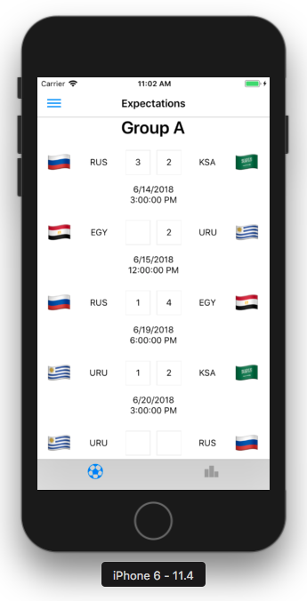

# React Native Penca

App to make our expectations for the Fifa World Cup Russia 2018.

# Test it!

Clone the project from: git@github.com:BuiltByBROS/react-native-penca.git

# Install dependencies

```sh
npm install
```

# Run on IOS Simulator

Download and install Xcode.


```sh
npm run ios
```

# Run on Android Simulator

Download and install Android Studio. Make sure to select: Android SDK, Android SDK platform (API 27)

Add the following env variables to your bash profile:

export ANDROID_HOME=/Users/{username}/Library/Android/sdk
export ANDROID_SDK_ROOT=/Users/{username}/Library/Android/sdk

To run on android emulator device: open Android Studio, 
select "Open an existing Android Studio Project" and locate react-native-penca/android folder.

Next go to tools -> AVD Manager, create or select a virtual device and run it.

Once emulator is running you can type:

```sh
npm run android
```

# Run on Android device:

Just plug in your phone and enable USB debugging.

# Run on IOS device:

Open Xcode, select the device, make sure to enter a developer team.

NOTE: To be able to run on devices, both computer and device must share the same network.


